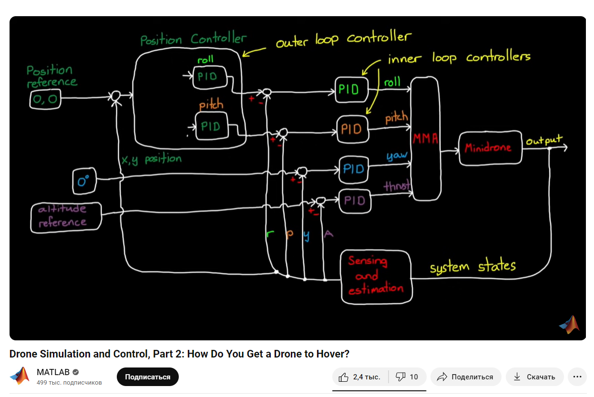
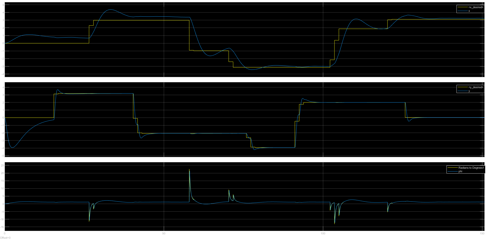
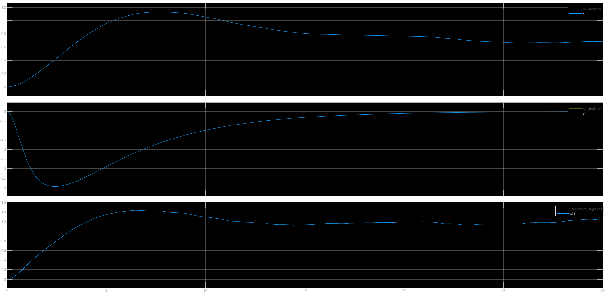
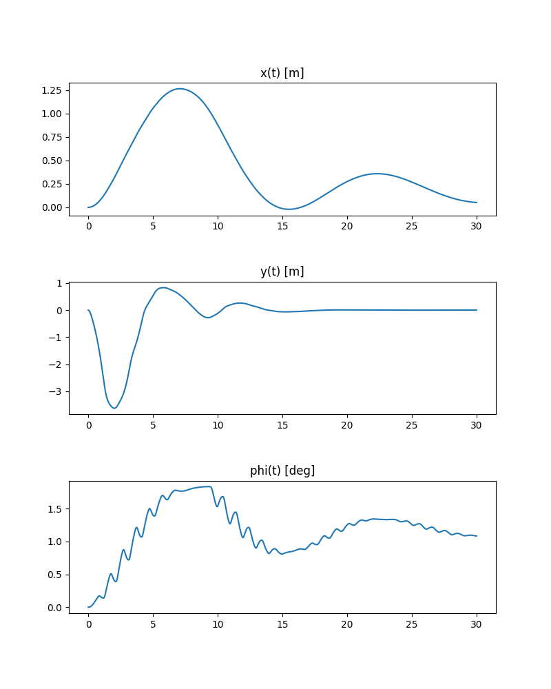
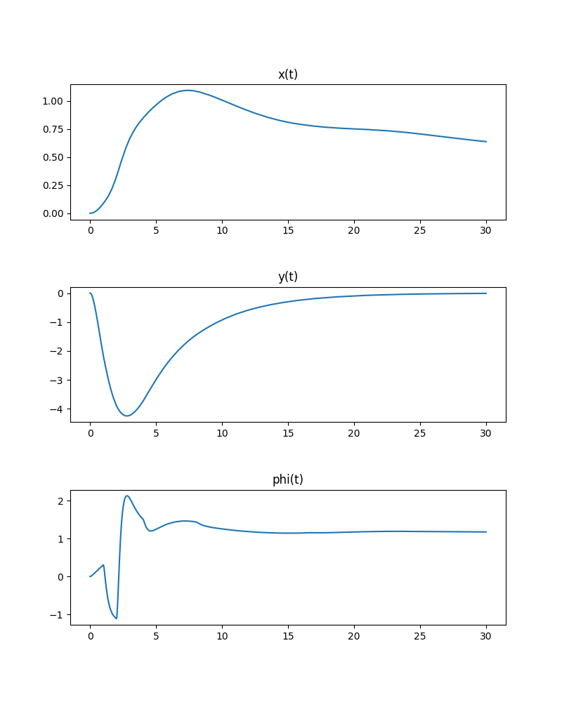

První pokus o ovládání kvadrokoptéry, ale ve 2D prostoru. 
Test v Python a kontrola v Matlab Simulink (nebo naopak...)
Zdroje https://cookierobotics.com/052/, 
https://www.youtube.com/watch?v=GK1t8YIvGM8&list=PLPNM6NzYyzYqMYNc5e4_xip-yEu1jiVrr&index=2 
a rady od Ing. Michala Kuchaře.

* V souboru [...control_0.slx](simulink_2D_Quadrotor_rotation_control_0.slx) je nejjednodušší ovládání, při kterém se nastavuje úhel natočení kvadrokoptéry. 
Protože systém má 3 stupně volnosti a pouze jeden vstup, pozice x a y kvadrokoptéry se libovolně mění.

* V souboru [...control_1.slx](simulink_2D_Quadrotor_position_rotation_control_1.slx) je realizováno kaskádové řízení, 
kde se nastavuje požadovaná poloha x a v závislosti na vzniklé odchylce 
je nastavena žadaná hodnota úhlu náklonu kvadrokoptéry, aby se pohybovala vpravo nebo vlevo.
Ovládá se pouze jeden parametr, moment T, proto výška není konstantní.

* Soubor [...control_2.slx](simulink_2D_Quadrotor_position_rotation_control_2.slx) 
je vylepšením [...control_1.slx](simulink_2D_Quadrotor_position_rotation_control_1.slx), 
nejprve byl změněn 2D model kvadrokoptéry, 
takže nyní řídíme dva parametry: normální tahovou sílu a zhruba řečeno delta sílu, 
která právě zavádí nerovnováhu a kvůli níž vzniká točivý moment. 
Lze nastavovat požadovanou polohu kvadrokoptéry ve 2D prostoru.

* Soubor [python_2D_Quadrotor_position_rotation_control_libpid.py](python_2D_Quadrotor_position_rotation_control_libpid.py) obsahuje 
implementaci [...control_2.slx](simulink_2D_Quadrotor_position_rotation_control_2.slx) s použitím PID z knihovny simple_pid.
Řízení soustavy probíhá, ale PID regulátor podle mého názoru funguje sporně. 
Simulace řízení se ne zcela shoduje se simulací v Simulinku. Filtr není implementován...

* Soubor [python_2D_Quadrotor_position_rotation_control_classpid](python_2D_Quadrotor_position_rotation_control_classpid.py)
je totožný s předchozím souborem, jen PID regulátor je implementován jako třída
(na základě funkce z [návodu](https://softinery.com/blog/implementation-of-pid-controller-in-python)) 
a je používán řešič odeint(). 
Výsledky regulace jsou mnohem bližší referenčnímu modelu Simulink, 
ale změna úhlu phi v čase vyvolává otázky.....
