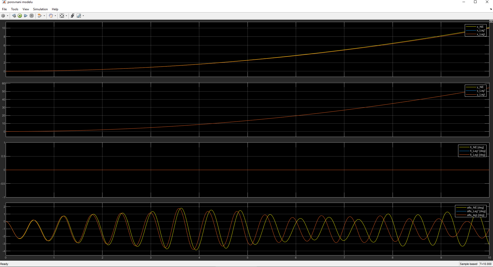

### V tomto testu snažím odvodit pohybové rovnice kvadrokoptéry se závěsným závažím ve 2D.
1. Obyčejné Newton-Eulerové rovnice -> [odvozeni_rovnic.mlx](odvozeni_rovnic.mlx), 
[odvozeni_rovnic_pokus2.mlx](odvozeni_rovnic_pokus2.mlx),
[odvozeni_rovnic_pokus3.mlx](odvozeni_rovnic_pokus3.mlx)

2. Použitím Lagrange  2. druhu (trochu rozšířená verze) -> 
[pokus_Lagrange.mlx](pokus_Lagrange.mlx), [pokus_Lagrange2.mlx](pokus_Lagrange2.mlx)

#### Newton-Euler
* Soubor [odvozeni_rovnic.mlx](odvozeni_rovnic.mlx) obsahuje moje odvození rovnic v takovém schematickém pořadí: 
[schema pro odvozeni_rovnic.mlx.one](schema%20pro%20odvozeni_rovnic.mlx.one).
V posledních řádcích byly získané 4 rovnice pravých stran stavového popisu systému, které byly použity 
v souboru [simulink_2D_Quadrotor_and_pendulum.slx](simulink_2D_Quadrotor_and_pendulum.slx) k modelování. 
* V něm testuju, jak probíhá řízení polohy kvadrokoptéry se závažím pomocí kaskádové regulací 
z [simulink_2D_Quadrotor_position_rotation_control_2.slx](..%2Ftest_3-2D_Quadrotor%2Fsimulink_2D_Quadrotor_position_rotation_control_2.slx), 
která ale byla naladěna na řízení kvadrokoptéry **BEZ** zavází 
(p.s. schéma řízení je stejná, ale jiné koeficienty; později upravím, aby byly stejné a porovnáme odlišnost řízení)
  * Součástí simulace je [soubor s parametry modelu a vizualizace pohybu](parametry_a_vizualizace.m)
  kvadrokoptéry, příklad video od 14.04.2024
  https://github.com/LevarGoldun/Project-Quadcopter/assets/116310407/5acaa051-8a79-4041-a888-a5b00be1349a

* V souborech [odvozeni_rovnic_pokus2.mlx](odvozeni_rovnic_pokus2.mlx) (kroky v [schema pro odvozeni_rovnic_pokus2.mlx.one](schema%20pro%20odvozeni_rovnic_pokus2.mlx.one)) a [odvozeni_rovnic_pokus3.mlx](odvozeni_rovnic_pokus3.mlx) 
jsem se snažil použit jiné kroky k odvození pohybových rovnic, ale nepodařilo se. 
Rovnice z [...pokus3.mlx](odvozeni_rovnic_pokus3.mlx) je dle DP Daniela Bukovského, 
ale má chybu v rovnice rotaci závaží a pak výsledné pohybové rovnice obsahovali algebraickou smyčku, 
tzn. nelze použit k stavovému popisu. No a navíc rovnice byly bez odporového tření...

#### Lagrange
* V [pokus_Lagrange.mlx](pokus_Lagrange.mlx) jsem zkoušel (bez podrobného studia) odvození pomocí Lagrange 2. druhu. 
Na konci jsem dostal 4. rovnice, ale bez konečného vyjádření druhých derivací vůči nižším derivacím atd. 
(tzn. je algebraická smyčka, lyl jsem líný to vyjadřovat). Ale výsledek se shoduje s rovnicemi 
z [odvozeni_rovnic.mlx](odvozeni_rovnic.mlx) (v mezičástech vyjádření rovnic).

* V [pokus_Lagrange2.mlx](pokus_Lagrange2.mlx) provádím odvození dle DP Tomase Ira a [článku](https://www.researchgate.net/publication/338542376_Sliding_Mode-Based_Control_of_a_UAV_Quadrotor_for_Suppressing_the_Cable-Suspended_Payload_Vibration) 
(**oběma věřím**). Drobné odlišeni od odvození výš je, že místo koeficientů odporu `k` (kvadrokoptéry) a 
`kp` (pendulum=kyvadlo) v DP se používají koeficienty `cx`, `cy`, `cfi`, `calfa` příslušných pohybu! 
Po použití LR 2.druhu dostavám rovnice s algebraickou smyčkou,  ale abych ji odstranil,
přepisuji všechny rovnice do maticového tvaru a pak pomocí inverze matic vyjadřuji konečné pohybové rovnice 
(a pak stavový popis). Bohužel rovnice vypadají šílené, protože Matlab nemůže provést jejích zjednodušení… 
**--> ~~asi musím ručně zjednodušit~~ (smrt)**.
[Newton-Euler model](odvozeni_rovnic.mlx) a [Lagrange model](pokus_Lagrange2.mlx) pák porovnávám v [porovnani_modelu.slxc](porovnani_modelu.slxc)
  * Je třeba předem spustit [soubor](parametry_Lagrange.m) (řádný odpor)
  * ~~Tabulka pro porovnání jednotlivých modelů (N-E a tři verze Lagrange modelu). 
  `+`=znamená, že chovaní modelů je shodné, `x`=liší se, `~`=vznikají rozdílyю.~~

~~|
  | Vstup do systémů:  | nic | Fcmd=(M+m)*g/2 | Fwind | Fwind a Fcmd=... |   |
  |--------------------|-----|----------------|-------|------------------|---|
  | Newton-Euler,      | +   | +              | ~     | x                |   |
  | Lagrange (inv),    | +   | +              | +     | +                |   |
  | Lagrange (\),      | +   | +              | +     | +                |   |
  | Lagrange (matice), | +   | +              | +     | +                |   |
  | Komentáře          |     |                |       | p.s.1            |   |   
  |~~
  ~~p.s.1 = Spiš bych řekl, že je divné chovaní Lagrange, tahy vrtule se rovnají gravitace, ale kvadrokoptéra padá…~~

* Bez odporů všechny N-E model a Lagrange model mají skoro stejný průběh (samozřejmě budou drobné odlišení, 
ale to je dáno již rozdílnými přístupy při vyjadřování rovnic). 
Přikládám , které ale nikdo kromě mě nepochopí :D

#### Výsledek
Pro další modelování a návrh řízení budu používat model 
odvozený pomocí Lagrangerove rovnice 2. druhu, tj. ze souboru [pokus_Lagrange2.mlx](pokus_Lagrange2.mlx).