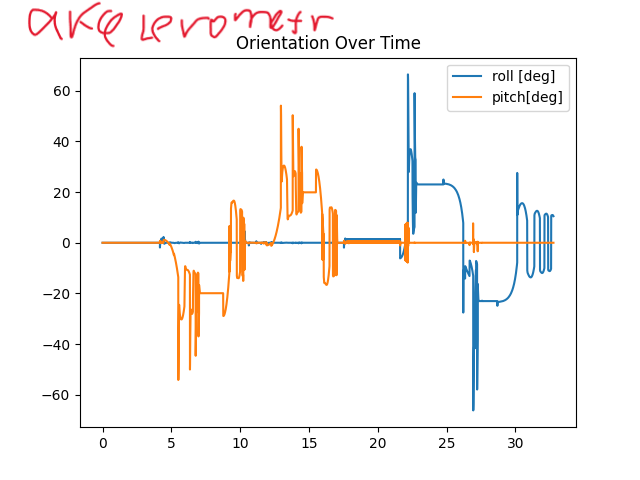
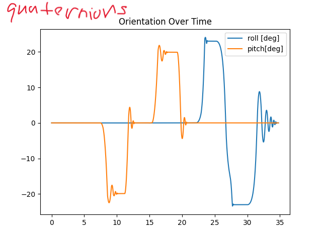
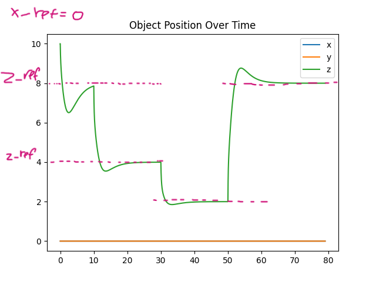

### Implementace kaskadoveho rizeni v MuJoCo
1. Verze kvadrokoptery 1.4 --> ma zavazi na nehmotnem lane

2. **Jak odecitat natoceni kvadrokoptery (hlavne roll a pitch)?** MuJoCo nema primy prikaz. 
Lze jak nam ukazovali v predmetu "Senzoricke systemy" spocitat z hodnot akcelerometu
--> ale velky sum a skok hodnot. Vlastni funkce pro vypocet uhlu roll a pitch z hodnot akcelerometru
`roll_pitch_calculation()`

3. Z `data.xquat[//sparvny index//]` lze scitat hodnoty kvaternionů telesa (body)
--> ve vlastni funkce `roll_pitch_calculation_scipy()` (a pomoci knihovny `scipy`) 
pocitam uhly roll a pitch.
   * Priklad namerenych uhlu roll a pitch z _akcelerometru_ a z _kvaternionu_
   
   
   
   
   --> data z kvaterionů čistší, takze ocekavam mensi poruchy v PIDkach...

4. Uhly roll a pitch z obou funkci jsou [deg], regulatory jsou ladeny pro [rad] --> nezapomenout prepocitat
5. Rizeni vysky je super (tzn. `x_ref`=0 a `z_ref`=nejake cislo).

   

6. NASEL JSEM SAKRA CHYBU PROC NEFUNGOVALO RIZENI VE SMERU X
   1. za prve jsem debil nasobil -1 (minus jednickou) jiny regulator
   2. za druhe (je to dusledek i.) nasobim -1 vystup z regulatoru `PID_phi_desired.control()`, nebo 
   zmenit znamenko jeho parametrů...
   
   Koeficienty regulatoru vyse byly navrzeny v Simulink v rovine 2D, kde osa X smeruje DOPRAVA
   V MuJoCo jsou pravouhle souradnice, takze X smeruje DOLEVA
   Nebo spravnejsi rict, otaceni kvadrkoptery v MuJoCo musi byt v jinem smeru, nez v Simulink...

7. Ted rizeni XZ probiha super, ale trochu pomaleji ve smeru X. Kopter by se mohl vice otocit

